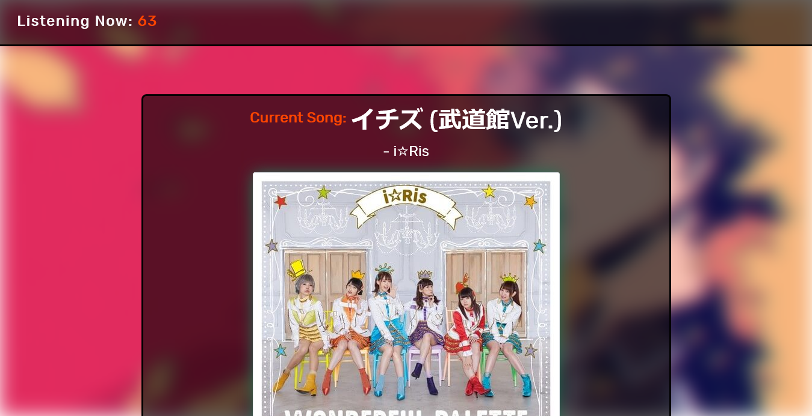
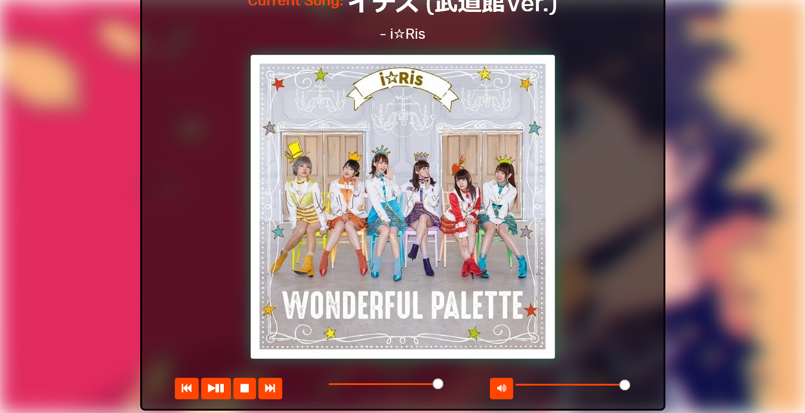

# **Jpop Radio**

## Listen to Jpop music online for free!

### The app has been tested on Firefox, Chrome and Edge. I can vouch for the app working fine on these browsers.

This is a radio web app that was created using the WebSocket API, HTML, CSS, Responsive Web Design, Javascript and Bootstrap. The channel sends data through, wss://listen.moe/gateway_v2 and the audio source is, https://listen.moe/stream.

The current listeners are displayed on the top left corner of the web app.

Moreover, the current song title, artist, and cover art is displayed. The previous two songs that were played also have their title, artist, and cover art displayed.

In addition, you have pause, play, skip, and stop audio controls that have been created from scratch. They have also been styled to go with the orangered, white and black theme of the app.

## PC

___

## Tablet

___

## Smartphone

